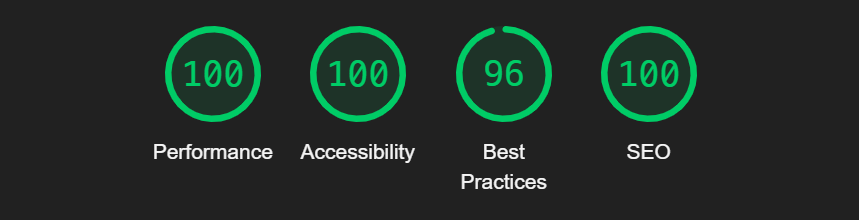

  
  <h1 align="center">calc | Frontend Mentor Challenge</h1>
  

    Math calculator do add, sub, multi, and division.
   

## Table of Contents

- [Overview](#overview)
  - [Quick Introduction](#quick-introduction)
  - [Challenge Requirements](#challenge-requirements-🏳)
  - [What I Implemented](#what-i-implemented-🤔)
  - [Screenshots](#screenshots-📸)
    - [Original Design](#original-design)
    - [Mine](#my-implementation-😎)
  - [Links](#links)
- [My process](#my-process)
  - [Built with](#built-with)
  - [what I learned](#what-i-learned)
- [Author](#author)
- [Special Thanks](#special-thanks)

## Overview

### Quick Introduction
This project is a simple calculator. The user enters the operation, and the app calculates their operation and give output. It includes input validation. Click [here](https://mohammed-aljablai.github.io/LifeClock/) to visit the website 😊.
**Note:** 
- The website still incomplete.
- This is a solution to the [Calculator App Challenge on Frontend Mentor](https://www.frontendmentor.io/challenges/).

### Challenge Requirements 🏳
> Users should be able to:
> - See the size of the elements adjust based on their device's screen size
> - Perform mathematical operations like addition, subtraction, .multiplication, and division
> - Adjust the color theme based on their preference
> - **Bonus**: Have their initial theme preference checked using `prefers-color-scheme` and have any additional changes saved in the browser

### What I Implemented 🤔
I still did not complete this website yet i will -In Sha Allah-.

### Screenshots 📸
#### Original Design

#### My Implementation 😎

**Notes:**
- I couldn’t match the exact padding, width, and other dimensions from the design, so my version may look slightly different 🌚.

<!-- ### Links -->
<!-- - Live Site URL: [Title]() -->

## Author
- Me 😎 ([@mohammed-Aljablai](https://github.com/mohammed-aljablai))
